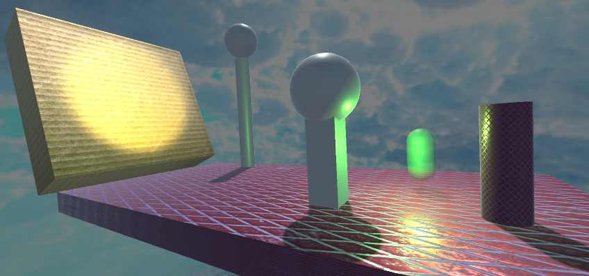
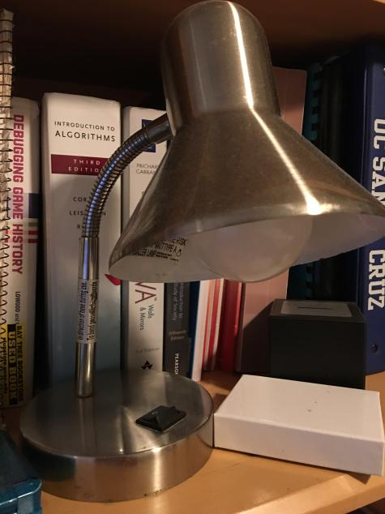
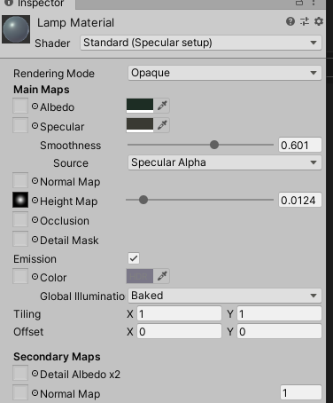

# CMPM163Labs

**Lab 2**

Part 1: https://drive.google.com/open?id=1lW7BqxMg_80I0Vx9bsRtYORlVL4aem9X

Part 2:

**Lab 3:**

https://drive.google.com/open?id=1aG4XlvxEIlUPwxaOiAzviF8coh1nuDUt

(phone recording washed out colors, but all four cubes have different values)

Top Cube: The example blue cube made with custom shaders. Rotation and values unchanged.

Left Cube: Cube made from three.js phong material with altered shine and color values. Rotation changed.

Right Cube: Cube made from the three.js phong material example. Color and shine unchanged. Rotation changed.

Bottom Cube: Cube made with custom shaders. New values for uniform added. Rotation changed.

**Lab 4:**

https://drive.google.com/open?id=1KW4brGeOlSMJpAC-J8SFC_Klkyfx_7Po

(screen recording)

Top Cube: Fourth Cube. Created as the second cube with a shader. Single tiling. Includes normal map. Unique texture.

Left Cube: First Cube. Created as a cube with basic texture functionality but no normals.

Middle Cube: Second Cube. Created as cube with basic texture functionality and normal map.

Right Cube: Third Cube. Created as first cube with shader. Single tiling. Includes normal map. Unique texture.

Bottom Cube: Fifth Cube. Created to implement multi-tiles on one surface, in this case Four. Solved by using the modulus function to get the remainder of the position (multiplied by however many tiles we need) when divided by 1, to prevent out of bounds colors. Includes shader, normal map, and unique texture.

24a. (max X size) * u = x

24b. (max Y size) * (1 - v) = y

24c. (3,5) = light gray

**Lab 5 (Unity Side)**

https://drive.google.com/open?id=1wTYKreOMFHArHlNPlc_DfoiYj7EF38r1

Notable changes to base:

-Horizon changed to Neon Glow material

-Ground changed to Basic Green material

-Cloud textures changed to Metal Silver material

-Main Character changed to Glass Clear material

-Kart Color changed to Peach Color material

-Main Character given a Witch Hat with altered scale and Neon Green material

-Checkpoint rings added and spread across map

-Laps System implemented

-Particle System implemented. Particle image is pixelated asset.

-Skybox Pattern changed. Same asset as Particles.

-Speed of Kart changed.

**Lab 6 (Part 1, Unity Side)**

Screenshot:

Definitions:

-Spotlight: Spotlights are like flashlights. They illuminate everything in a cone, and respond to both rotation and position.

-Point Light: Behaves like bare lightbulb. Based on pure position, no rotation influence

-Directional Light: Behaves like the sun. Affects all objects in scene.  Based on rotation, position is irrelevant.

-Area Light: Only apply in a light map. They only shine on one side of a rectangular plane. 

Real Life Material (Lamp):

Lamp's Material in Unity:

-Material: The lamp's material can be seen on the two spheres and cylinders in the scene. I started by picking out a dark grey albedo color, and adjusting the values until I found something that hit the right level of metallic I wanted. The position of these two lamps relative to the camera was important, as the main illumination was the Point Light behind it. The shine texture provided by default in sample projects worked well to define the height map.

-Textures: There are two textures in the scene, a chain floor texture and a cardboard texture. The chain floor texture was applied to the ground and rightmost cylinder, and the cardboard texture was applied to the wall the spotlight ricochets off. Normals have been applied to the textures, copies of the original texture turned into Normal Maps.

-Skybox: The skybox I added was a more vibrant image of the sky taken from Google Images.

**Lab 7 (Part 1, Unity Side)**

https://drive.google.com/open?id=1kPfVaXa9USSXSShhtZGZ1LQe8-PwHlzQ

This project was a fun one! I picked the Unity side. I got around to the tutorials very quickly, so I had a bit of time to build the scene how I wanted.

The clouds you see in the scene are the distorted mesh spheres from the first tutorial. The albedos and opacities have been altered to be more red and clear, and scripts have been added to their behavior to make them scroll to the right of the scene and show back up on the other side with varying Y and Z values. There are a total of three active at a time.

For the mountains, they're also distorted mesh spheres. Well. actually, six of them. They're positioned, rotated, and scaled in a way to resemble a mountain island. What you see in the project is roughly 30% of the Mountain Range, the other 70% is below the ocean waves.

I applied the ocean waves fairly easily, with one catch: every possible albedo shade could only be a variant of red. I imagined the aesthetic I wanted to be a calm blue island, so I decided to move in a different direction: how about a Blood Moon themed scene? The skybox, mountain colors, and cloud colors will altered to support that look.

For the final thing I wanted to add, I added the blood moon itself. It is textured with the Universal Pipeline's 2D Sprite Lit Default Shader, with a surface I found online. It emits a point light, but is very slight.

Partner Feedback: My partner did the Three.JS section of the lab. I thought their decision of where they placed the camera was cool, it made it look like you were standing on a mountaintop! I had finished my project by the time my partner was ready.
