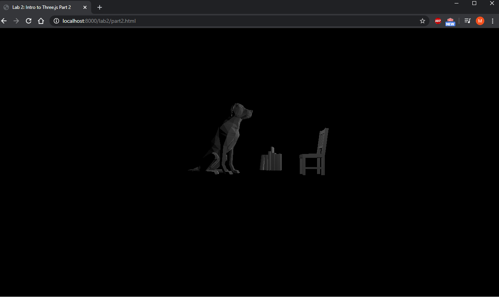

# CMPM163Labs

**Lab 2**

Part 1: https://drive.google.com/open?id=1lW7BqxMg_80I0Vx9bsRtYORlVL4aem9X
Part 2:

**Lab 3:**

https://drive.google.com/open?id=1aG4XlvxEIlUPwxaOiAzviF8coh1nuDUt
(phone recording washed out colors, but all four cubes have different values)

Top Cube: The example blue cube made with custom shaders. Rotation and values unchanged.
Left Cube: Cube made from three.js phong material with altered shine and color values. Rotation changed.
Right Cube: Cube made from the three.js phong material example. Color and shine unchanged. Rotation changed.
Bottom Cube: Cube made with custom shaders. New values for uniform added. Rotation changed.
